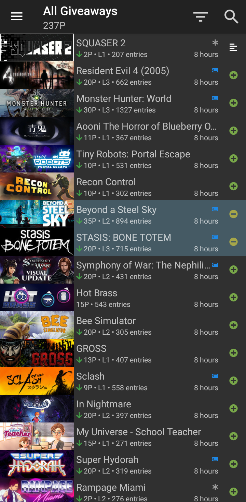
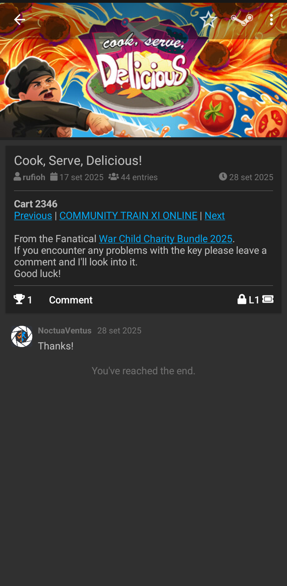
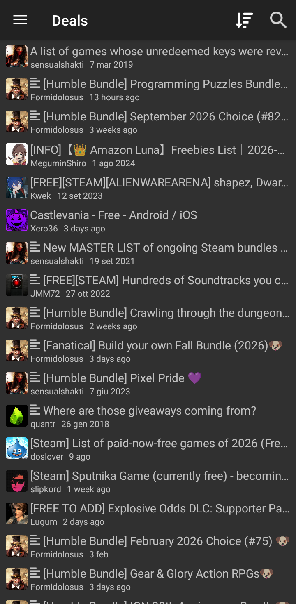

#  SteamGifts - NV Edition

An Android application to browse and manage SteamGifts giveaways, discussions, and user profiles right from your mobile device.

## ✨ Features

> [!NOTE]
> You will need to log in to use most features

### 🎁 Giveaways
- Browse & search All, Group, Wishlist, Recommended, and New giveaways.
- Enter, leave, and comment on giveaways.
- View the Steam page for the giveaway's game, or link to SteamDB if delisted
- Filter by level, entry count, copies, point cost, or dlc.
- Display indicators for giveaway characteristics and game features. 
- Hide and un-hide games.

### 💬 Discussions
- Browse & search through various discussion categories.
- Vote in polls and view attached images.
- Read, create, and reply to comments on discussions and giveaways.

### 🔔 Sync & Notifications
- Manually sync your Steam library with SteamGifts.
- Notifications for won giveaways, unread messages, and full point capacity.

### ⚙️ Utilities
- Bookmark giveaways and discussions for later.
- Open `steamgifts.com` links from the browser or via Android's share menu.
- Go directly to a Giveaway, Discussion or User from their id.

## 📥 Installation

### Build Flavors

- **Vanilla**: Stable production releases.
- **Chocolate**: Beta and developer builds.
